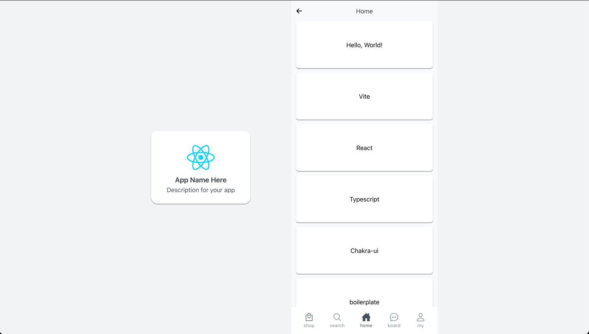

# Mobile Webapp boilerplate with React + TypeScript + Vite + Chakra UI

## How to run

* `npn run dev` : local development
* `npm run build` : building for production

## Using libraries and version

* @chakra-ui/react@3.2.4
* @emotion/react@11.14.0
* open-color@1.9.1
* react@18.3.1
* react-dom@18.3.1
* react-icons@5.4.0
* react-router@7.1.1

## Preview

